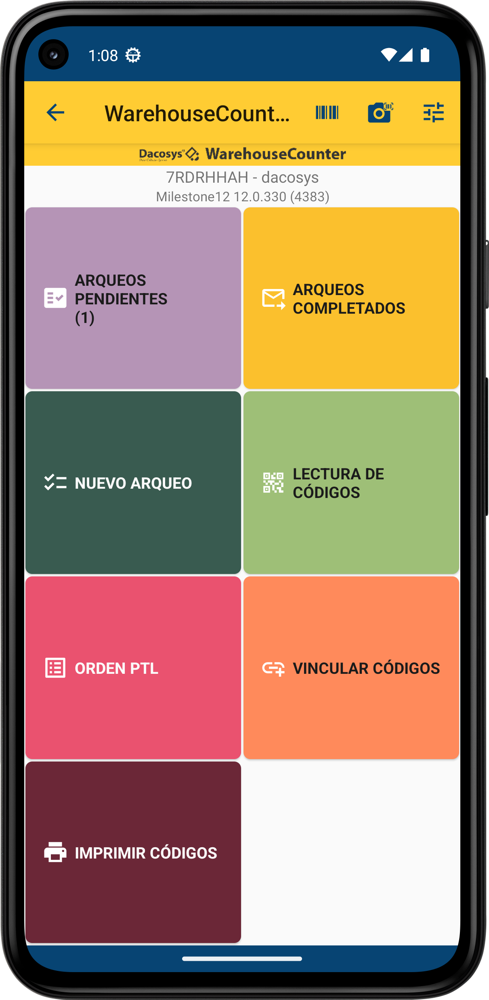
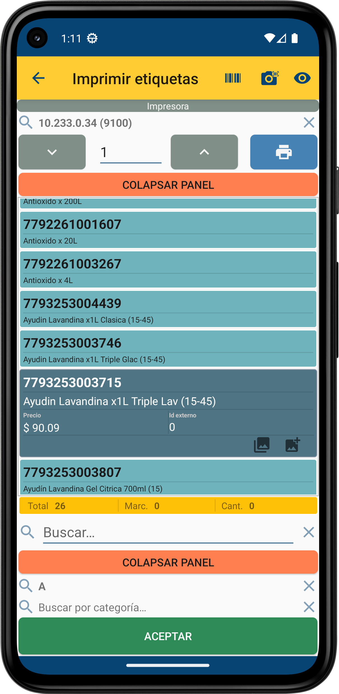
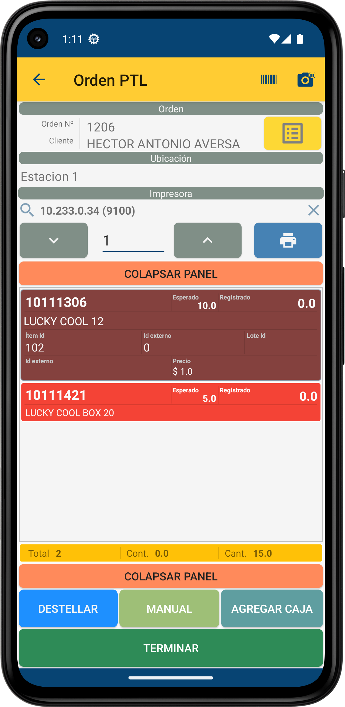
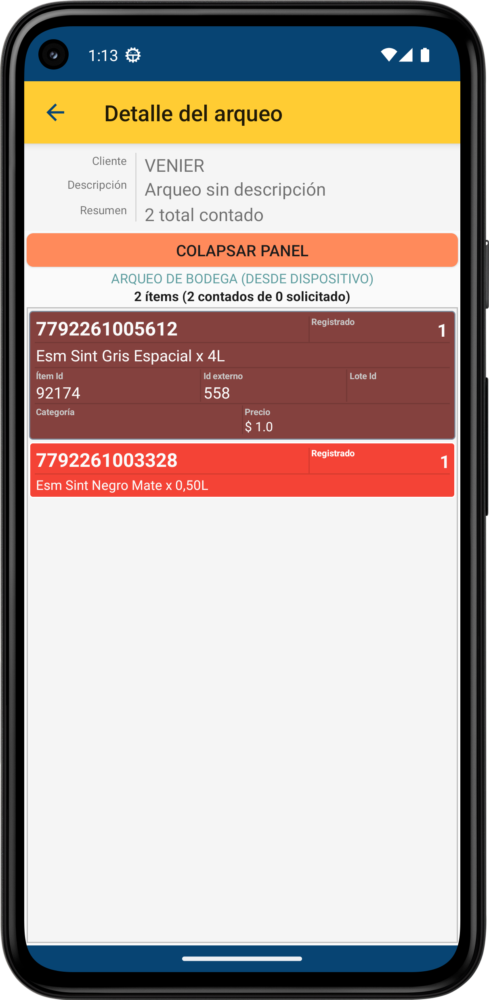

 

    

<h3 align="center">WarehouseCounter</h3>
    

        App para conteo de bodega
         
		<a href="http://resources.dacosys.com/Warehouse_Counter/Milestone12/installers/android/warehouseCounter-release.apk">Descarga</a>
        ·
        <a href="https://github.com/AgustinGomila/warehouse_counter_android/issues">Reportar Bug</a>
        ·
        <a href="https://github.com/AgustinGomila/warehouse_counter_android/issues">Solicitar cambios</a>
    

<!-- TABLE OF CONTENTS -->
## Tabla de contenidos

* [Librerías utilizadas](#librerías-utilizadas)
* [Algunas características](#algunas-características)
* [Acerca del proyecto](#acerca-del-proyecto)
    * [Capturas de pantalla](#capturas-de-pantalla)
* [Contacto](#contacto)

## Librerías utilizadas

* [Kotlin](https://kotlinlang.org/)
* [Koin](https://github.com/InsertKoinIO/koin)
* [Room](https://android.googlesource.com/platform/frameworks/support/+/androidx-master-dev/room)
* [Ktor](https://github.com/ktorio/ktor)
* [ZXing](https://github.com/journeyapps/zxing-android-embedded)

## Algunas características

+ Arqueos de bodega, auditorías de stock, de recepciones y despachos.
+ *Pick to Light*.
+ Vinculación de nuevos códigos.
+ Captura y vinculación de imágenes de productos.
+ Soporte para lectoras de códigos de multiples simbologías.
+ Soporte para impresión de etiquetas en impresora de red o Bluetooth.
+ Configuración por medio de escaneo de códigos.

## Acerca del proyecto

**WarehouseCounter** es una aplicación para Android escrita en Kotlin diseñada especialmente para dispositivos móviles de lectura de códigos y forma parte de una solución integral de gestión de inventario.
Esta solución más amplia ofrece un funcionamiento en remoto que puede mantener sincronización de datos con otros gestores de inventario, permitiendo una administración eficiente y centralizada.

Proporciona funciones como arqueos de bodega, auditorías de stock, recepciones y despachos, *Pick to Light*.
Permite la vinculación de nuevos códigos a productos existentes y la captura de imágenes para una identificación visual más precisa.
Además, ofrece soporte para lectores de códigos de múltiples simbologías y la posibilidad de imprimir etiquetas en impresoras de red o Bluetooth.
La aplicación es multiusuario y permite la configuración a través de escaneo de códigos para una fácil implementación.

### Capturas de pantalla

|  |  |
|---------------------------------------------------------------------------------------------|---------------------------------------------------------------------------------------------|
| Pantalla principal de la aplicación.                                                        | Pantalla de Catálogo de productos, impresión de etiquetas, etc.                             |

|  |  |
|---------------------------------------------------------------------------------------------|---------------------------------------------------------------------------------------------|
| Pantalla de *Pick to Light*.                                                                | Pantalla de Detalle de Arqueo de bodega.                                                    |

## Contacto

Proyecto: [https://github.com/AgustinGomila/warehouse_counter_android](https://github.com/AgustinGomila/warehouse_counter_android)